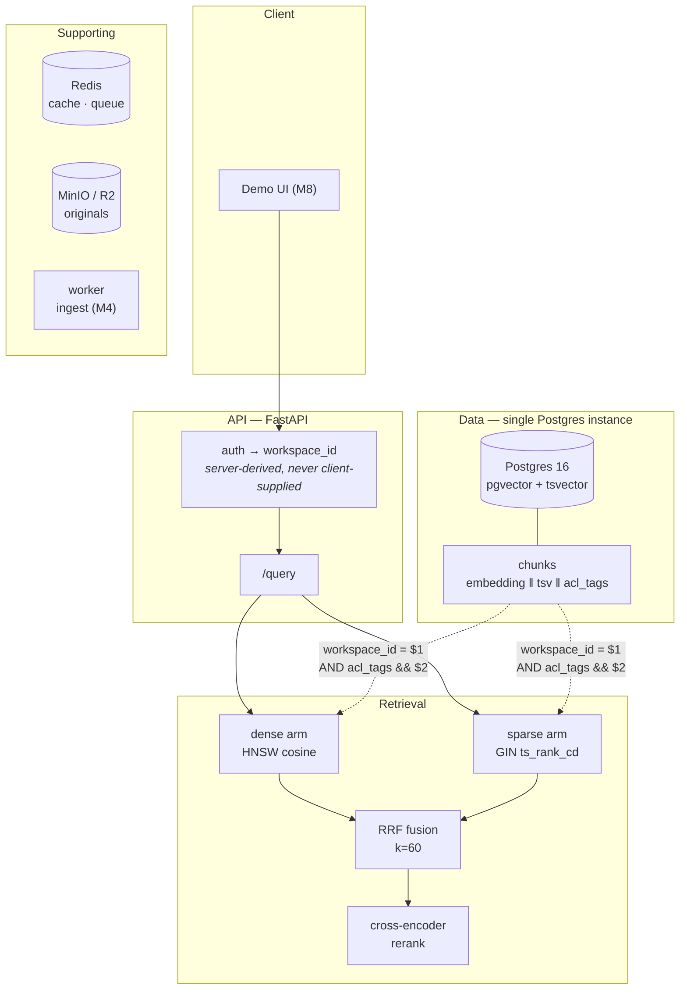

# Grounded Knowledge Platform

[](https://github.com/aditya0si/grounded-knowledge-platform/actions/workflows/ci.yml)
[](https://www.python.org/)
[](https://mypy-lang.org/)
[](LICENSE)

**Enterprise-grade RAG where the retrieval numbers are measured, not asserted.**

ACL-enforced hybrid retrieval over an internal-docs corpus. Retrieval quality is
measured against gold chunk labels and gated in CI; permission boundaries are
enforced *inside* the retrieval predicate rather than filtered after the fact.

---

## Why this exists

Most RAG projects, including the prototype this one replaces, report an
impressive faithfulness score produced by a harness that **could not have
failed**. In the predecessor repo the evaluation corpus came to 151 words in
three chunks while the retriever requested `top-k=6` — so retrieval returned the
entire corpus on every query, and every published metric was a measurement of
generation alone. The test set carried no gold chunk identifiers, which meant
recall@k, MRR, and nDCG were not computable at all.

The pipeline was fine. The **harness** was the problem, and a harness that cannot
fail cannot defend an improvement.

This project is built the other way round: the evaluation harness exists before
the retrieval improvements it measures, and it is designed so that a regression
turns the build red.

## Status

Honest, per-milestone. Nothing below claims to be finished when it is not.

| Milestone | Scope | State |
|---|---|---|
| **M0** | Skeleton, dev stack, CI, strict typing | ✅ complete |
| **M1** | Corpus, golden set, metric functions, dense baseline, ACL negative control | 🚧 in progress |
| **M2** | Hybrid retrieval (RRF) + cross-encoder rerank, proven by ablation | ⬜ planned |
| **M3** | Parsing / chunking / embedding ablation | ⬜ planned |
| **M4** | Durable, idempotent ingestion | ⬜ planned |
| **M5** | Tenancy and authentication | ⬜ planned |
| **M6** | Verified citations, untrusted-context hardening | ⬜ planned |
| **M7** | Cost, latency, observability, load test | ⬜ planned |
| **M8** | Live demo surface | ⬜ planned |

The full plan, including the milestone acceptance criteria, lives in
[`.hermes/plans/`](.hermes/plans/).

## Architecture



**Both retrieval arms and the permission predicate execute in one transactional
query.** A dedicated vector database forces a two-phase *fetch-then-filter*,
which either leaks rows across permission boundaries or silently destroys recall
when the filter is applied after ANN. See [ADR-001](docs/adr/ADR-001-postgres-over-vector-db.md).

## Design decisions

| ADR | Decision |
|---|---|
| [001](docs/adr/ADR-001-postgres-over-vector-db.md) | Postgres + pgvector + tsvector over a dedicated vector DB |
| [002](docs/adr/ADR-002-evaluation-before-optimization.md) | Build the evaluation harness before the retrieval improvements |
| [003](docs/adr/ADR-003-deterministic-retrieval-metrics.md) | Retrieval metrics computed in-process; LLM judges only for generation |
| [004](docs/adr/ADR-004-server-derived-acl.md) | ACL filtering is server-derived and applied in the retrieval predicate |

## Quickstart

Requires [uv](https://docs.astral.sh/uv/) and Docker.

```bash
git clone https://github.com/aditya0si/grounded-knowledge-platform.git
cd grounded-knowledge-platform

uv sync --all-extras          # create the locked environment
python scripts/tasks.py up    # start Postgres + Redis + MinIO, wait for health
python scripts/tasks.py check # ruff + mypy --strict + unit tests
```

The API runs on **:8010** (ports are offset from their defaults so this stack can
coexist with other local Postgres/Redis containers):

```bash
python scripts/tasks.py serve
# then: http://localhost:8010/docs
```

**The test suite passes with no provider API key and no running infrastructure.**
Anything requiring live services is marked `integration` and excluded from the
default job. Retrieval evaluation (M1/M2) makes no LLM calls at all, so the
measured-retrieval story is reproducible at zero cost.

### Task runner

`make` is not available on every development machine, so tasks are defined once
in [`scripts/tasks.py`](scripts/tasks.py) and the `Makefile` delegates to it —
there is exactly one definition of each command, so local and CI runs cannot
drift.

```bash
python scripts/tasks.py --list
```

## Repository layout

```
src/gkp/
  api/         HTTP layer — routers and schemas
  core/        config, logging, Redis, security
  db/          SQLAlchemy models, Alembic migrations, repositories
  ingest/      parsing, chunking, embedding, durable queue (M4)
  retrieve/    dense · sparse · RRF fusion · reranking
  generate/    provider adapters, prompts, citation verification (M6)
  eval/        corpus · golden set · metric functions · runners · reporting
```

## What this project does *not* claim

Stated up front so the numbers above are read in context:

- **No retrieval-quality numbers are published yet.** M1 produces the dense
  baseline; M2 produces the ablation. Anything shown before then would be a
  measurement of the harness rather than the system.
- **The evaluation corpus is synthetic.** The *methodology* is real and the
  corpus is published and reproducible; the *document distribution* is not a
  real enterprise corpus. This is stated in the results, not buried.
- **Single-node Postgres.** The ACL design is scale-ready; the deployment is not.
  No horizontal-scale claim is made.
- **No uptime, throughput-at-scale, or cost-per-user figures** until M7's load
  test and a live deployment actually produce them. If they are not measured,
  they are not published.

## Roadmap

Evaluation-first, by construction: corpus and golden set → metric functions →
dense baseline → ACL negative control → hybrid + rerank proven by ablation →
parsing ablation → durable ingestion → tenancy → verified citations → cost and
latency → demo surface.

## License

MIT — see [LICENSE](LICENSE).
